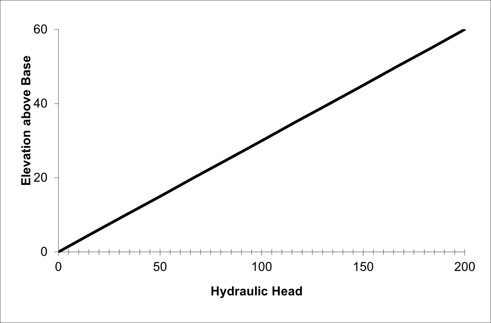
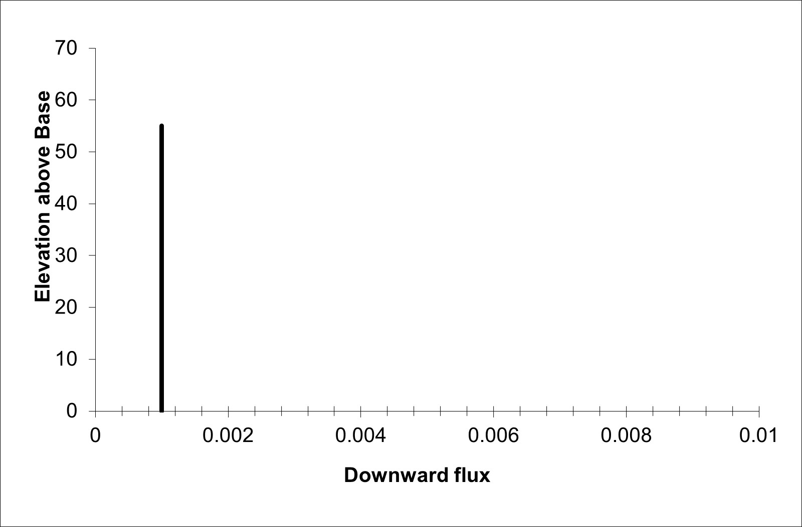
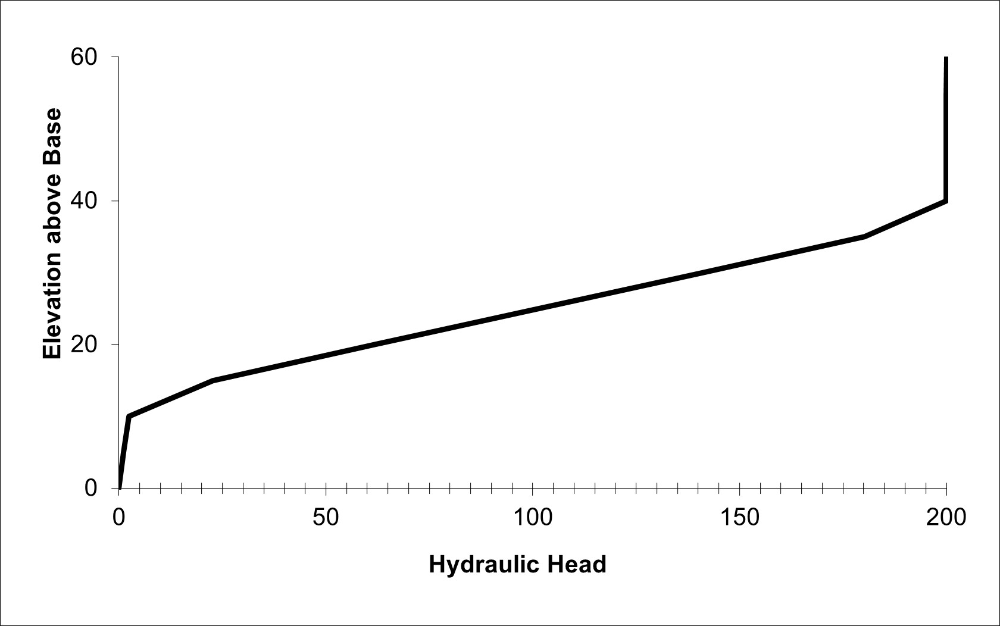
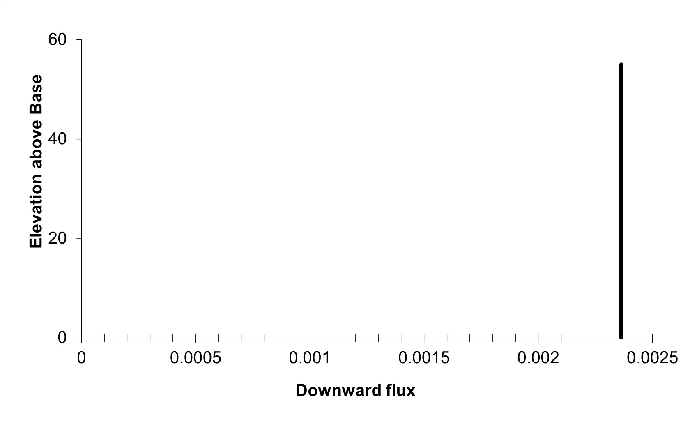
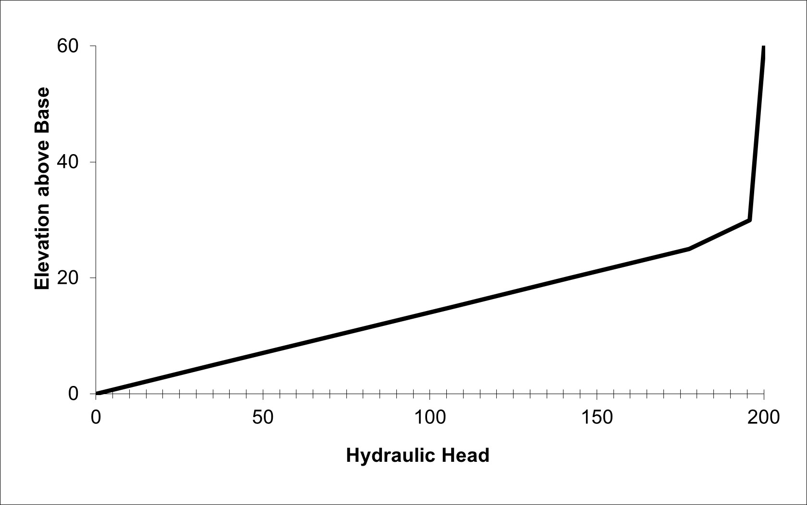
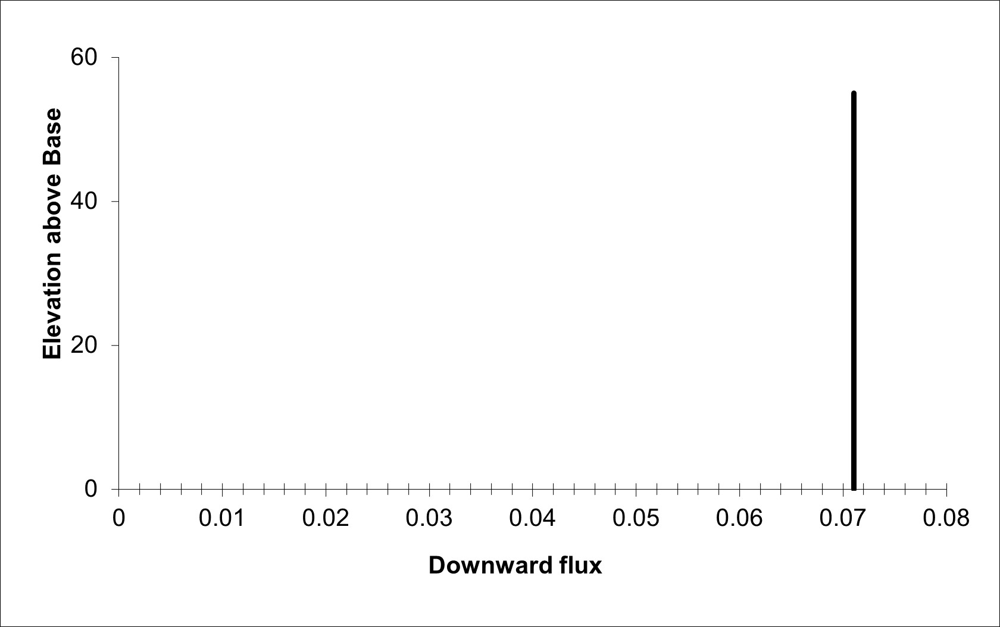

## HW #1 Discussion Questions
### Connal Boyd
### 01/27/22

### Challenge Questions:
**1.) Show, based on the flux with depth, that the model is steady state. Repeat this for a homogeneous and for a heterogeneous column.**

  

The image above shows a homogeneous soil column head profile. This graph exhibits a linear relationship between hydraulic head and depth within the column.

 

The downward flux profile of a homogeneous soil column can be seen above. This profile indicates flow within the column is under steady-state conditions since the downward flux with depth is constant, creating the vertical line seen on the graph above.

The behavior of the hydraulic head profile is slightly different for a heterogeneous soil profile than a homogeneous soil column due to the difference in hydraulic conductivities of the soils within the soil column, as indicated by the graph below.

However, steady state can still be achieved within the heterogeneous soil column as indicated by the constant downward flux with depth profile as seen below.

**2.) Show that the steady state flux agrees with the direct calculation based on the harmonic mean average K. Write the equation defining the direct calculation of the flux.**

For the heterogeneous column the steady state flux (q) was found to be 0.002363. To check if this value agrees with the harmonic mean average K I used the equation q = Q/A = -K * dh/dz. In this equations K is the Keq calculated in the model and has a value of 0.000709, dh is the change in hydraulic head between the top of the soil column and the bottom of the soil column (200, in this case), and dz is the change in elevation (60, in this case). The dh/dz term was multiplied as a negative rate in order for the math to work out properly, and because the flow is moving downward. When all of these values are plugged into q = -Keq * (-dh/dz), the two sides of the equation equal the same number. This shows that the steady state flux agrees with the direct calculation of the harmonic mean average K.

**3.) Show the steady state head profile for a column with approximately equal-thickness layers that have different K values.**

The figure above shows the hydraulic head profile for a heterogeneous soil column with only two soil types of approximately equal depths. The two soil types can be distinguished by the significant difference in slope of the hydraulic head v. elevation lines on the graph above.

This graph shows the downward flux v. depth of a heterogeneous soil column with two soil types. Flow within the column can be seen to be steady-state since the downward flux v. elevation is constant as seen above.

**4.) Use the head profile to explain WHY the equivalent hydraulic conductivity, Keq, is closer to the lower of the two K values.**

Mathematically, the smaller K value input into the Keq equation will dominate the calculation, driving the resulting Keq value toward that initial input K value. This is what makes the Keq value close to the smaller of the two K values in the soil profile. I am not sure how to get this information from the head profile. My first thought is that there is some indication from the slopes of the two lines produced by the soil profiles, but I am not sure.

### Discussion Questions:
**1.) What are boundary conditions?  Answer this both conceptually and mathematically.**

Boundary conditions provide physical constraints for an experiment. They help provide structure for understanding the conditions at play in a given environment. Mathematically, they come to bear in many ways. For example, in this model the boundary conditions affect the behavior of the hydraulic head throughout the soil profile as well as the dh/dz when checking if the steady state flux agrees with the Keq.

**2.) What are model parameters?  How do they (and don't they) represent the actual subsurface?**

Model parameters are factors that we may not know for certain about an environment we are modeling. We gain an understanding of them from scientific background and they may provide context about the subsurface, but they are not necessarily true data points that have been directly collected from the subsurface.

**3.) What are steady state conditions and how can they be identified from the Excel model results?**

Steady state conditions occur when the incoming flow to a system matches the outgoing flow of the system. This means that the the flow is constant, and the change in storage within the system is zero. One way to  identify steady state conditions is from the downward flux v. depth graph of a soil column. If the graph is a vertical line, then there are steady state conditions at play. I am still unclear how to determine steady state accurately from the hydraulic head graphs of a soil column.

**4.) Can you imagine how the model inputs could be stored in separate files rather than other spreadsheet cells?  Describe the flow of information from a file that describes the other files that contain model-specific information about the system.**

It would be easy to use a python file to call other python files to do this. By referencing separate python files within the main model file, I would be able to store all of my inputs in separate input python files. This would allow me to change my inputs without significantly changing the body of the model.

**5.) What is an iterative solution?  Can you explain it to a hydrologist who is not a modeler?  Can you describe (or imagine) how Excel finds the solution?**

An iterative solution is one that solves a problem by referring to itself in order to reach the answer. It does this over and over until a specific number of iterations has been reached. At this point an answer is reached, or the model breaks. In Excel, the equation refers to the same cell the equation is entered into and it runs through the equation a set number of times.

**6.) What is a direct solution?  What are its (dis)advantages compared to an iterative (numerical) solution?**

Direct solutions are more analytical wheras iterative solutions can get closer to the true solution of an equation? I am not sure. I had trouble with my iteration in excel and could not get the Solver to work in my model. I am not quite sure my model ran correctly even though I was able to produce graphs.